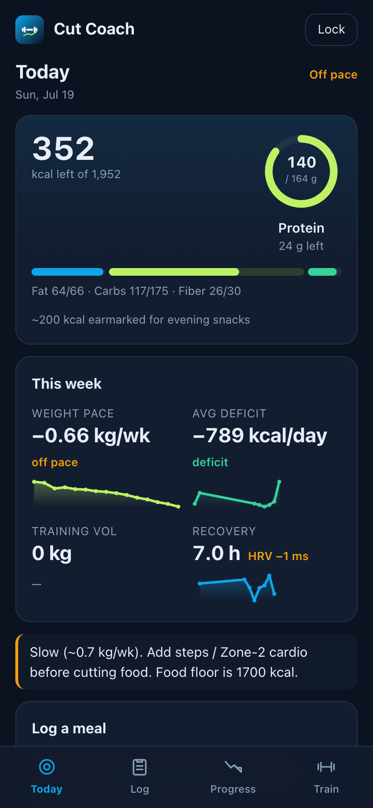
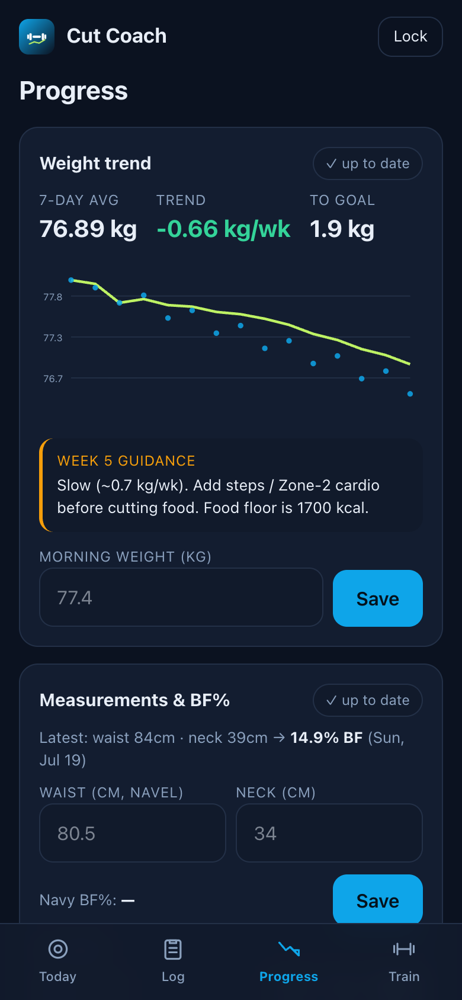

# Cut Coach

A nutrition and training tracker that does its macro math on your own Claude, not a paid API.

Plenty of people already paste meals into Claude to count calories, because it's the fastest way to do it. What Claude doesn't have is a UI that remembers your goals, or anywhere to keep the history. The apps that wrap that loop for you all call the Claude API, which costs money per meal. Cut Coach queues each meal for the Claude subscription you already pay for, renders it against your targets, and stacks Garmin, steps, training, and health on top.

It runs as one PIN-locked app for one person. You put your stats in a single config file and it computes the rest.

<p align="center">
  
  &nbsp;&nbsp;
  
</p>

## How it works

Today is where food goes. You log a meal as free text and it saves right away with the macros left pending. Once Claude fills the numbers in, the kcal and protein rings and the remaining-macros strip update. Protein and fat are floors, carbs are a ceiling not a target, and there's a small snack budget on top of the day.

Progress works off the weight trend. Each morning's weigh-in rolls into a 7-day average with a week-over-week slope, and the coach line compares that slope to your target loss rate and tells you to hold, eat more, or tighten. Waist and neck give a US Navy body-fat estimate; weekly photos stack up next to it.

Train runs a seeded 4-day upper/lower split. Start a session, log each set with weight, reps, and RPE, get a per-exercise overload cue, keep the history. If you sync a Garmin watch, a day can push to it and guide the session set by set, since Garmin can't log strength work after the fact.

Health is an optional Garmin sync. It pulls daily expenditure, steps, and BMR, so the deficit math is sized on what you actually burned that day instead of a formula.

## The macro loop

No meal calls an LLM at request time. It saves as raw text with the macro columns null, showing as pending in the app. A Claude session picks up the pending rows, researches the real per-serving numbers, and writes them back:

```
node scripts/list-pending.mjs          # {id, date, slot, text} for every pending meal
# Claude estimates kcal / protein / fat / carb / fiber per text, then:
node scripts/enrich.mjs <id> <kcal> <protein> <fat> <carb> <fiber>
```

The macro columns stay nullable on purpose, so an in-app LLM key could take over the same job later with no migration.

## Run it locally

You need a Supabase project (free tier is fine) and Node.

```
npm install
```

1. Create the tables and the default program: run [`db/schema.sql`](db/schema.sql) in the Supabase SQL editor.
2. `cp .env.example .env.local` and fill it in. The PIN hash line has the one-liner to generate it.
3. Set your stats in [`src/lib/targets.ts`](src/lib/targets.ts). Edit the `PROFILE` block; the calorie and macro targets compute from it.
4. `npm run dev` and open http://localhost:3000.

Garmin, if you want it, is separate and optional: point `scripts/garmin_sync.py` at your own Garmin account. Without it the app just shows blanks for the health tiles and uses the computed TDEE.

## How it's built

Next.js 16 (App Router) and React 19, a Supabase Postgres behind it, Tailwind 4, deployed on Vercel and installable as a PWA. A few choices worth calling out:

- The macro math runs on a Claude subscription instead of the metered API. That's the reason the app exists, and it's why meals save first and get their numbers second.
- Targets are computed, not hand-set. Mifflin-St Jeor BMR times an activity factor gives maintenance, and the weekly loss rate sets the deficit. Once Garmin data arrives, real measured expenditure replaces the estimate.
- The cut is treated as a control loop. The 7-day rolling average and its slope drive the guidance, so one bad day of water weight doesn't move the plan.
- Auth is a single PIN and a signed cookie. One person per deployment means no accounts table and no per-row ownership, just one opaque session token issued on every correct PIN.

## What it doesn't do

- Not multi-user. No signup, no accounts, one profile per deployment. Two people means two deployments.
- No automatic macro counting. Meals sit pending until a Claude session runs against them, so the numbers lag the eating. That's the tradeoff for not paying per meal.
- Body-fat is male-only. The Navy formula in `src/lib/bf.ts` only implements the male equation so far.
- Not a general fitness app. It assumes an aggressive cut and one upper/lower split, not a flexible plan you configure in the UI.

## License

Personal project, no license. Ask if you want to use a piece of it.
